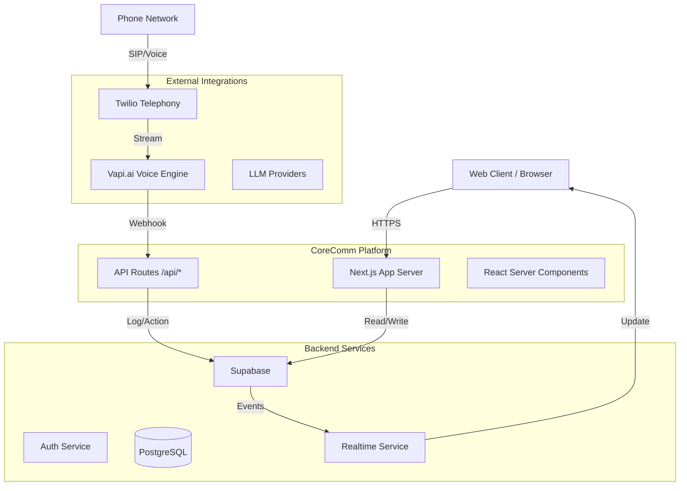

# System Architecture

## Overview

CoreComm is a modern web application built on the **Next.js App Router** framework. It leverages **Supabase** for backend services (database, auth, realtime) and integrates with **Vapi** for AI voice capabilities.

## High-Level Architecture



## Key Components

### 1. Frontend (Next.js)
- **Framework**: Next.js 14+ (App Router)
- **Language**: TypeScript
- **Styling**: Tailwind CSS + Shadcn UI
- **State Management**: React Hooks + Server State (via Supabase)

The frontend is organized into:
- **`(dashboard)`**: Protected routes for authenticated users.
- **`auth`**: Public routes for login/signup.
- **`api`**: Server-side API endpoints.

### 2. Backend & Database (Supabase)
- **Database**: PostgreSQL
- **Authentication**: Supabase Auth (JWT based)
- **Security**: Row Level Security (RLS) policies enforce data access rules at the database level.
- **Realtime**: Subscriptions for live updates (e.g., call logs, transcriptions).

### 3. Voice Integration (Vapi)
- **Role**: Handles the core voice AI logic (STT, LLM processing, TTS).
- **Communication**:
  - **Outbound**: CoreComm API sends configuration to Vapi.
  - **Inbound**: Vapi sends webhooks to CoreComm API (`/api/webhooks/vapi`) with call status, transcripts, and function calls.

### 4. API Layer
Located in `app/api/`, these endpoints handle:
- **Webhooks**: Receiving events from Vapi, Stripe, etc.
- **Business Logic**: Complex operations not suitable for direct client-side DB access.
- **Proxying**: Securely communicating with third-party APIs (hiding API keys).

## Data Flow

### Authentication Flow
1. User enters credentials on `/auth/login`.
2. Supabase Auth validates and returns a JWT.
3. JWT is stored in a cookie (handled by `@supabase/ssr`).
4. Middleware (`middleware.ts`) checks the cookie on protected routes.

### Call Handling Flow
1. **Incoming Call**: Twilio receives call -> forwards to Vapi.
2. **Processing**: Vapi processes speech -> sends webhook to CoreComm.
3. **Logging**: CoreComm API (`/api/webhooks/vapi`) validates the request and logs the call to Supabase `call_logs` table.
4. **Realtime Update**: Supabase pushes the new log to the dashboard via Realtime subscription.

## Directory Structure

```
/app                    # Next.js App Router root
  /(dashboard)          # Dashboard layout & pages
  /api                  # API Endpoints
  /auth                 # Auth pages
/components             # React components
  /ui                   # Generic UI components (buttons, inputs)
  /billing              # Billing-specific components
/lib                    # Shared utilities
  /supabase             # Supabase client & server helpers
/hooks                  # Custom React hooks
/supabase               # Database migrations & seeds
/deployment             # Deployment scripts & docs
```

## Design Decisions

- **Server Components**: Used heavily for initial data fetching to reduce client bundle size and improve SEO/performance.
- **RLS (Row Level Security)**: We rely on RLS for security, meaning the frontend can often query the DB directly for read operations, while complex writes or admin tasks go through API routes.
- **TypeScript**: Strict mode is enabled to ensure type safety across the full stack.
