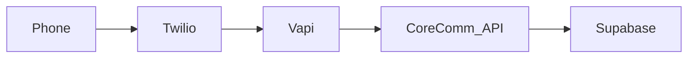

# CoreComm – AI Voice Agent Platform

CoreComm is an AI-powered, voice-first customer support solution that enables companies to handle incoming phone calls with a conversational AI agent. It combines telephony, speech recognition, and LLMs to deliver accurate, context-aware support.

---

## 📚 Documentation Index

- **[Getting Started](GETTING_STARTED.md)**: Setup guide for new developers.
- **[Environment Setup](ENVIRONMENT_SETUP.md)**: Required environment variables and configuration.
- **[Architecture](ARCHITECTURE.md)**: System overview, diagrams, and directory structure.
- **[API Reference](API_REFERENCE.md)**: API endpoints and authentication.
- **[Deployment Guides](deployment/README.md)**: Instructions for deploying to production.
- **[Documentation Plan](DOCUMENTATION_PLAN.md)**: Roadmap for project documentation.

---

## 🚀 Quick Start

### Prerequisites
- Node.js 18+
- Supabase Project
- Vapi Account

### Local Setup
```bash
# 1. Clone the repo
git clone <repository-url>

# 2. Install dependencies
npm install

# 3. Setup environment
cp .env.example .env.local
# (Fill in Supabase and Vapi keys)

# 4. Run development server
npm run dev
```
*For detailed instructions, see [GETTING_STARTED.md](GETTING_STARTED.md).*

---

## 🛠️ Tech Stack

- **Frontend**: Next.js 14 (App Router), React, Tailwind CSS, Shadcn UI
- **Backend**: Supabase (PostgreSQL, Auth, Realtime)
- **Voice AI**: Vapi.ai (Orchestration), Deepgram (STT), ElevenLabs (TTS)
- **Infrastructure**: Docker, Vercel (Frontend), AWS (Optional)

---

## 💡 Concept Summary

CoreComm enables companies to handle incoming phone calls with a conversational AI agent capable of understanding natural speech, responding in real time, and performing actions through MCP server integrations.

### Key Features
- **Real-time Voice AI**: Low-latency conversation handling.
- **RAG Integration**: Answers grounded in company knowledge base.
- **Action Execution**: Performs tasks via MCP (Model Context Protocol).
- **Live Dashboard**: Real-time call monitoring and analytics.
- **Human Handoff**: Seamless escalation to live agents.

---

## 🔍 How It Works

### Call Connection
1. Customer dials the support number.
2. Call is routed via Twilio/SIP to CoreComm.

### AI Processing
1. **STT**: Speech converted to text (Deepgram/OpenAI).
2. **Intelligence**: LLM understands intent and retrieves context (RAG).
3. **Action**: Executes tasks if needed (MCP).
4. **TTS**: Generates voice response (ElevenLabs/Azure).

### Architecture Diagram
*(See [ARCHITECTURE.md](ARCHITECTURE.md) for detailed diagrams)*



---

## 📂 Project Structure

```
/app                    - Next.js App Router
/components             - React Components
/lib                    - Shared Utilities
/supabase               - Database Migrations
/deployment             - Deployment Scripts
```

---

## 🤝 Contributing

Please read [GETTING_STARTED.md](GETTING_STARTED.md) for development guidelines.
