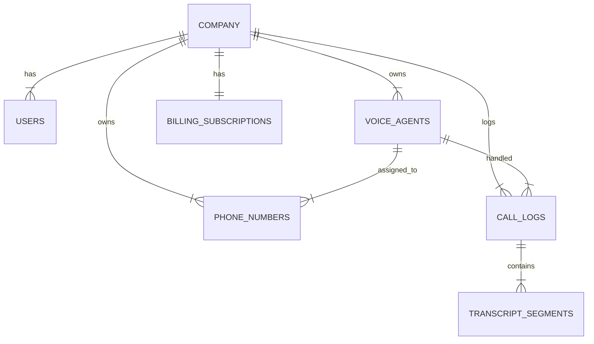

# Database Schema

This document outlines the database schema for CoreComm, hosted on Supabase (PostgreSQL).

## Overview

The database uses **Row Level Security (RLS)** to ensure users can only access data belonging to their organization (Company).

## Tables

### `company`
Stores organization details.
- **id** (uuid, PK): Unique identifier
- **name** (text): Company name
- **company_size** (enum): 'small', 'medium', 'large'
- **industry** (text): Industry sector
- **timezone** (text): Default timezone
- **created_at** (timestamp): Creation date

### `users`
Extends Supabase Auth users with application-specific profile data.
- **id** (uuid, PK): References `auth.users.id`
- **email** (text): User email
- **full_name** (text): Display name
- **role** (enum): 'admin', 'member'
- **company_id** (uuid, FK): References `company.id`
- **onboarding_completed** (boolean): Track setup progress
- **metadata** (jsonb): Flexible storage for user preferences

### `voice_agents`
Configured AI agents for handling calls.
- **id** (uuid, PK): Unique identifier
- **company_id** (uuid, FK): Owner company
- **name** (text): Agent name (e.g., "Support Bot")
- **voice_id** (text): Vapi/ElevenLabs voice ID
- **system_prompt** (text): Instructions for the LLM
- **is_active** (boolean): Enable/disable status

### `phone_numbers`
Phone numbers assigned to agents.
- **id** (uuid, PK): Unique identifier
- **company_id** (uuid, FK): Owner company
- **number** (text): E.164 formatted number (e.g., +15550000000)
- **provider** (text): 'twilio', 'vonage', etc.
- **agent_id** (uuid, FK): Assigned voice agent

### `call_logs`
History of all calls processed.
- **id** (uuid, PK): Unique identifier
- **company_id** (uuid, FK): Owner company
- **agent_id** (uuid, FK): Agent that handled the call
- **caller_number** (text): Customer's number
- **duration_seconds** (int): Call length
- **status** (text): 'completed', 'missed', 'failed'
- **recording_url** (text): Link to audio file
- **transcript_summary** (text): AI-generated summary
- **started_at** (timestamp): Call start time

### `transcript_segments`
Detailed conversation logs.
- **id** (uuid, PK): Unique identifier
- **call_id** (uuid, FK): References `call_logs.id`
- **speaker** (text): 'user' or 'assistant'
- **text** (text): Spoken content
- **timestamp** (timestamp): When the segment occurred

### `billing_subscriptions`
Subscription status and plan details.
- **id** (uuid, PK): Unique identifier
- **company_id** (uuid, FK): Owner company
- **stripe_subscription_id** (text): Stripe reference
- **status** (text): 'active', 'past_due', 'canceled'
- **current_period_end** (timestamp): Renewal date

## Relationships (ERD)



## Security Policies (RLS)

- **Select**: Users can view rows where `company_id` matches their own `company_id`.
- **Insert**: Users can insert rows with their own `company_id`.
- **Update**: Admins can update rows for their company; Members may have restricted update rights.
- **Delete**: Typically restricted to Admins.

## Migrations

Migrations are managed in `supabase/migrations/`.
To apply migrations locally:
```bash
supabase migration up
```
To create a new migration:
```bash
supabase migration new name_of_change
```
